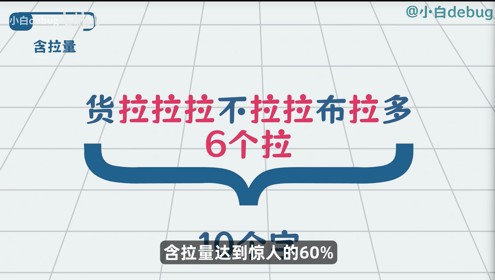
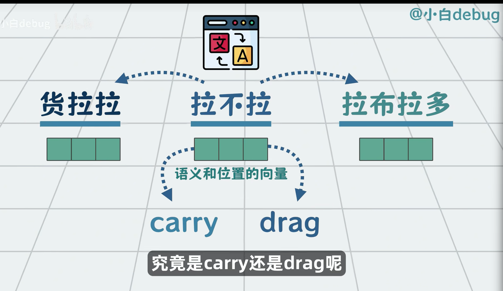
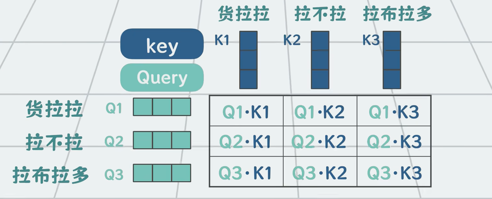
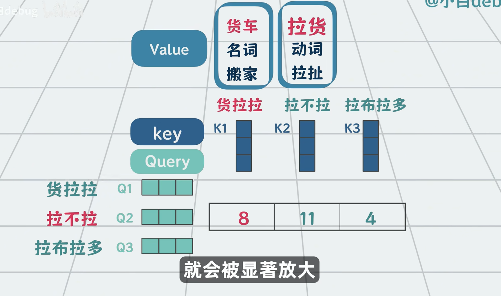
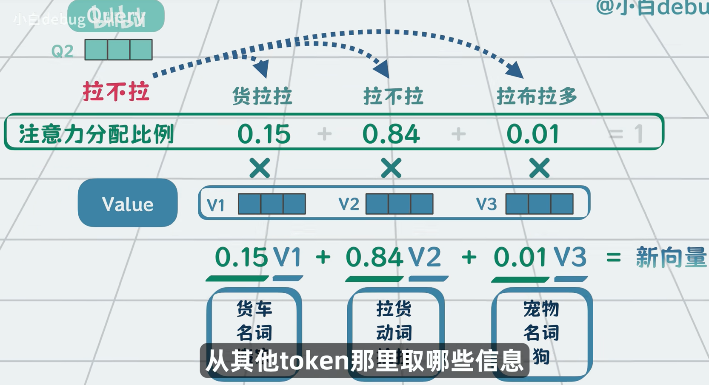
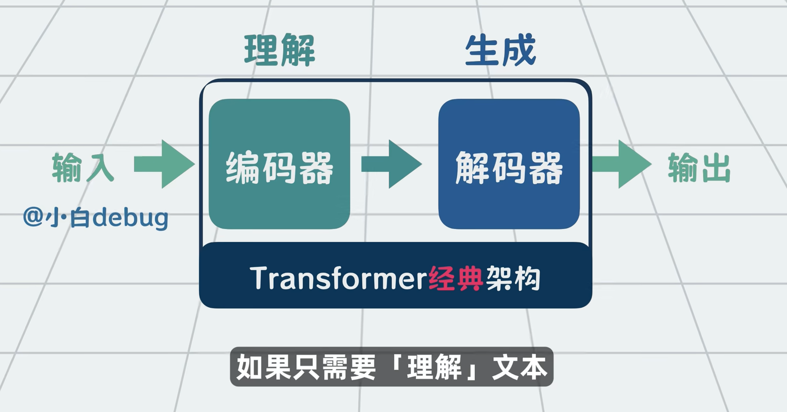

# AI

```{toctree}
:maxdepth: 1
./local-ai-service.md
./agent.md
./production-deployment.md
./pair-coding.md
./multi-model-debate.md
./cloud-service-testing.md
```

## 学习笔记: 视频记录

### 视频一: [从词向量到Transformer, AI大模型背后的原理, 一个动画急速入门](https://www.bilibili.com/video/BV1nogs6qEZn/?share_source=copy_web&vd_source=2f16beddb156bf5939a7b19f9044d409)

场景:
轩辕养了一只__(A鹦鹉, B汽车, C熊猫, D苹果)

视频用"填空"这个场景串起了语言模型的演进史。每一代模型都是为了修复上一代的缺陷而生, 理解这条线, 就理解了今天的 Transformer 为什么长这样:

```{mermaid}
flowchart LR
    A[N-gram<br/>统计词组概率] -->|修复: 语义| B[词向量<br/>语义相近的向量相近]
    B -->|修复: 记忆| C[RNN<br/>隐藏状态循环传递]
    C -->|修复: 长期记忆| D[LSTM<br/>细胞状态+三个门]
    D -->|修复: 并行| E[Transformer<br/>自注意力]
```

> 图示: 语言模型的演进不是拍脑袋, 每一步都是对上一个方案"致命伤"的修复。

#### N-gram: 统计词组出现频率

**思路**: 数历史上"养了一只"后面出现哪个词最多。出现过"养了一只鹦鹉", 没出现过"养了一只苹果", 所以选 A。

**致命伤**: 无法理解语义关系, 依赖已经出现过的组合。A 变成虎皮鹦鹉就失效了——历史上没有"养了一只虎皮鹦鹉"这个组合, 概率就是 0。

更本质地说, N-gram 有三个问题:

1. **数据稀疏**: 绝大多数词组历史上从未出现过, 概率全为 0;
2. **组合爆炸**: 词表有 V 个词, n-gram 就有 V^n 种组合, 数不完也存不下;
3. **没有语义**: 它看到的只是字符串, 不知道"鹦鹉"和"虎皮鹦鹉"是同类。

#### 词向量 (word embedding): 给词一个坐标

**思路**: 给每个 token 一个多维向量, 语义相近的词, 向量也相近。知道虎皮鹦鹉和鹦鹉相关, 所以"养了一只虎皮鹦鹉"也能得分, 修复了 N-gram 的缺点。

词向量解决的是"词的含义怎么用数字表示"的问题: 把 one-hot(几万维, 只有一位是 1)压成几百维的稠密向量, 训练目标是让经常出现在相似上下文里的词, 向量距离更近。经典的"国王 - 男人 + 女人 = 女王"就来自这个性质。

**致命伤**: 每个词的向量是固定的, 不随上下文变化。"苹果"是水果还是手机, 同一个向量无法区分; 而且只能处理固定长度的上下文, 很久以前的数据直接丢弃, context 很短。

#### RNN: 给网络一个"记忆"

**思路**: 增加一个隐藏状态, 每个 token 进来都刷新当前状态向量——把之前读到的信息压缩进一个向量里, 一路传递下去。修复了词向量"没有记忆"的问题。

```
时间轴:   x1      x2      x3
          |       |       |
          v       v       v
h0 ---> [RNN] -> [RNN] -> [RNN] ---> 输出
          |       |       |
          h1      h2      h3

其中 h1 = f(x1, h0), h2 = f(x2, h1) ...
```

**致命伤**: 只有一个隐藏状态, 长期信息无法保留——传了几十步之后, 前面的信息被一遍遍"刷新"冲淡了(梯度消失), 状态里只剩最近的内容。而且每一步都依赖上一步的结果, 无法并行。

#### LSTM: 让信息有选择地留下

**思路**: 在 RNN 基础上增加一个细胞状态(cell state), 由模型自己控制信息的流动。在 RNN 基础上, 保留 VIP 信息——三个门分别控制 VIP 信息的退出机制、引入机制、输出时的挑选机制:

| 笔记里的说法 | 标准术语 | 作用 |
|------------|---------|------|
| 退出机制 | 遗忘门 (forget gate) | 决定丢掉哪些旧信息 |
| 引入机制 | 输入门 (input gate) | 决定写入哪些新信息 |
| 推理的挑选机制 | 输出门 (output gate) | 决定对外输出哪部分状态 |

三个门都是"一个 sigmoid + 一个乘法": sigmoid 输出 0~1, 乘在信息流上, 相当于一个可以学习的阀门。因为信息是"挑选"过的, 细胞状态可以像一条高速公路贯穿整个序列, 长期信息得以保留。

**致命伤**: 需要顺序计算——第 n 步必须等第 n-1 步算完, 无法大规模并行, 训练速度被卡死。

#### Transformer: 一步看全部

**思路**: 用自注意力(self-attention)让每个 token 直接和其他所有 token 交互, 不再依赖上一步的状态。修复了 LSTM 的顺序计算问题——整个序列可以同时算。具体原理见下一个视频的笔记。

### 视频二: [Transformer是什么? 2017年那篇"无人问津"的论文, 为何成了今天AI爆炸的起点? 10分钟速通AI论文天花板《Attention is all you need》](https://www.bilibili.com/video/BV1G4iMBeEWH/?share_source=copy_web&vd_source=2f16beddb156bf5939a7b19f9044d409)



遇到这种翻译问题, 每个拉的含义不一样, 怎么处理呢?

"货拉拉拉不拉拉布拉多"——三个"拉"字各是各的意思。视频把 Transformer 拆成三个问题来回答: 怎么分词、怎么消歧、顺序怎么办。

#### 第一步: 分词 (tokenization)

把句子分成 token: 货拉拉 / 拉不拉 / 拉布拉多。

1. 凭什么这么分? 分词器根据词频和子词组合的概率来切(BPE 类算法): 常见词组保持完整, 罕见词拆成更小的子词, 在词表大小和表达能力之间取平衡。
2. 分完的每个 token 查表得到一个向量, 这是后续所有计算的起点。



#### 第二步: 消歧 — 自注意力 (self-attention)

拉不拉怎么区分是"拉货的拉不拉"还是"拉拽的拉不拉"? 答案不是查字典, 而是**看上下文**: 看它和谁一起出现。

给每个 token 生成 Q, K, V 三个向量(输入向量分别乘以三个可训练的矩阵 Wq、Wk、Wv):

- **Q (Query)**: "我想找什么"——当前词发出的查询;
- **K (Key)**: "我是什么"——每个词给自己贴的标签;
- **V (Value)**: "我的实际含义"——被加权求和的原材料。

求 value: 用当前的 Q 和所有词的 K 做点积, 值大说明二者比较接近。比如此时"拉不拉"的拉拽含义和"货拉拉"的货运含义相乘就比较大, 所以货拉拉这里是运输工作, 拉不拉是拉货。




完整的计算流程:

```{mermaid}
flowchart LR
    A[输入向量 x<br/>每个 token 一个] --> B[乘以 Wq Wk Wv<br/>得到 Q K V]
    B --> C[Q 与所有 K 点积<br/>得到注意力分数]
    C --> D[softmax 归一化<br/>变成 0~1 的权重]
    D --> E[权重 × V 加权求和<br/>得到新的向量]
```

> 图示: 一个 token 的新向量 = 所有 token 的 V 按"和我有多相关"加权求和。所以同一个"拉"字, 在不同句子里算出的向量完全不同——消歧就是这么实现的。这个"看上下文重写自己"的机制, 就是论文标题里的 attention。

#### 第三步: 顺序 — 位置编码 (positional encoding)

顺序怎么办? 拉布拉多 / 拉不拉 / 货拉拉 就是不一样的意思了。

注意力机制本身是"无序"的: 每个 token 和所有 token 平等交互, 打乱顺序算出的向量完全一样。所以必须显式告诉模型位置: 给每个位置的向量加上一个**位置编码**(正弦函数生成的固定模式, 或训练出来的向量), 再进入注意力计算。位置信息融进向量里, 模型才能区分"拉布拉多拉不拉"和"拉不拉拉布拉多"。

从每个向量的值里找到最大的, 就是拉不拉的最新向量——注意力权重最高的那个词, 对结果贡献最大。





#### 为什么这篇论文成了今天的起点

《Attention is all you need》的核心主张是: 不需要 RNN 的循环, 不需要 CNN 的卷积, **只靠注意力机制**就能完成序列建模:

- **全并行**: 所有 token 同时计算, 训练速度不再被顺序卡死;
- **长距离直达**: 任意两个 token 之间的信息通路都是"一步", 没有 RNN 几十步传递的衰减;
- **可扩展**: 层数、宽度可以一直堆, 堆出了后来的 GPT、BERT 和今天的一切。

```{note}
顺序问题被位置编码解决了, 记忆问题被"一步看全部"的注意力解决了, 并行问题被矩阵运算解决了——这就是 Transformer 对视频一里全部致命伤的答卷。
```

#### 学完原理, 动手实践

- [从0开始搭建本地 AI 服务](./local-ai-service.md): 把 Transformer 模型跑在自己电脑上;
- [从0开始搭建一个 Agent](./agent.md): 让模型调用工具、完成任务;
- [从学习到生产](./production-deployment.md): 正式部署该怎么做。
