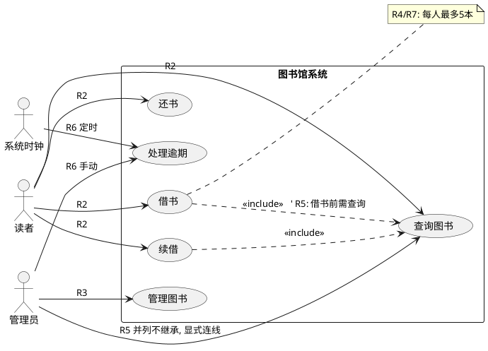

# 如何向 AI 提需求: 防遗忘、防冲突的业界做法

让 AI 画一张用例图, 常遇到两个毛病: **记住后面的要求、忘了前面的**; **几个要求冲突时, 它悄悄选一个, 不告诉你**。

这两个都是 LLM 的已知弱点: 注意力随上下文变长而衰减(重近轻远), 遇到矛盾指令时倾向静默消解(通常选最后说的那句)。业界(prompt engineering + 传统软件工程)已形成一套成熟打法, 本文先讲方法, 再用一个完整的用例图示范。

## 解决方案总览

### 1. 需求结构化: 编号 + 优先级 + 单一事实源(SSOT)

不要让需求散落在聊天记录里, 写成一份带编号的需求文档, 人和 AI 都以它为准。每条需求带:

- **编号**: R1、R2、R3…… 方便引用和核对;
- **优先级**: 常用 MoSCoW 法(Must / Should / Could / Won't);
- **版本**: 文档有版本号, 冲突时"文档里最新的版本就是真相", 而不是聊天里最新的那句;
- **冲突裁决规则**: 预先写死"真冲突时怎么办"。

这就是传统软件工程 PRD 的思路, 也是现在各种 `AGENTS.md` / `CLAUDE.md` 的做法——把规则放进 AI 每次必读的文件, 而不是指望它记住三个月前的对话。

### 2. 生成前先"对齐": 复述 + 冲突检测(read-back)

核心 prompt 协议一句话: **"先不要生成, 先复述。"**

让 AI 在动手前: 逐条复述需求 → 列出发现的冲突、歧义、缺失 → 给出处理方案 → 等人确认。这一步能把大部分"默默做错"变成"显式暴露", 类似工程里的需求评审会。

### 3. 冲突时让 AI 显式停下来, 而不是悄悄选

训练 AI 的响应协议: 发现不可调和的冲突时,

1. 列出冲突双方和各自代价;
2. 给出 A/B/C 选项;
3. 如果用户没定裁决规则, 选保守方案并显著声明"我假设了 X"。

### 4. 图示"代码化": PlantUML/Mermaid + 增量编辑

对用例图这类交付物尤其重要: **图必须是文本格式、存成文件**。后续修改走"编辑文件"而不是"重新生成整张图"——重生成才会丢需求, 改文件天然只动相关行。

### 5. 验收清单 / 需求溯源(traceability)

交付时要求 AI 附一张核对表: 每条需求 → 图中哪个元素满足。出现 N/A 就意味着有需求被悄悄丢弃——这是发现"顾后不顾前"的探针。这是软件工程里 Requirements Traceability Matrix 的老概念。

### 6. 生成后自检(LLM-as-judge)

让 AI(或开一个新会话, 效果更佳)切换成评审员角色, 拿原始需求逐条审输出, 只报告不修改。

### 7. 控制变更方式

新需求只说**新的那部分**, 不要让 AI"把之前的要求重新说一遍再改"。重大变更去更新需求文档本身, 让图跟随文档。

## 完整示范: 图书馆管理系统用例图

### 反例: 常见失败写法

> 帮我画图书馆系统的用例图。读者借书还书, 管理员管理图书。借书最多5本。管理员也是读者。哦不对, 管理员不用继承读者。读者和管理员都能查书。管理员主要管书和罚款。用例图规范点画……

问题: 要求散落在自然语言里、自我否定("也是读者"→"不用继承")没有标注哪个算数、没有任何核对机制。AI 大概率记住最后几句, 丢了中间的。

### 第一步: 写需求文档 `requirements.md`

```markdown
# 图书馆系统用例图需求 v3(2026-09-29)
优先级: P0 必须 > P1 应尽量 > P2 可选

R1 [P0] actor: 读者、管理员、系统时钟(定时任务)
R2 [P0] 读者用例: 借书、还书、查询图书、续借
R3 [P0] 管理员用例: 管理图书(增删改)、处理逾期
R4 [P1] 借书约束: 每人最多 5 本
R5 [P0] 管理员与读者是并列 actor, 不继承
   (注: v1 曾写"管理员继承读者", v3 推翻, 以本条为准;
    管理员的"查询图书"通过 include 复用同一用例)
R6 [P1] 逾期处理: 系统时钟定时触发, 管理员也可手动触发
R7 [P2] 图中用 note 标注"最多5本"
R8 [P0] 输出: PlantUML, 存为 usecase.puml

冲突裁决规则:
1. 文档内高版本/新条目优先于旧描述
2. 无法满足任何 P0 时, 必须停下来问我, 不许默默放弃
```

注意 R5 的处理: 自我否定直接写进文档并注明哪个生效——这就是"冲突显性化"。

### 第二步: 生成前对齐 prompt

```
读 requirements.md。先不要生成图, 依次输出:
1. 你对每条需求的理解(各一句话)
2. 你发现的冲突、歧义、缺失
3. R5 你打算在图里怎么处理
等我确认后再生成。
```

AI 此时应该给出类似这样的输出:

```
冲突检测:
- R5 vs v1 遗留: 按裁决规则1采用 v3(并列不继承)。
  处理方案: 管理员/读者各自连"查询图书", 该用例
  通过 <<include>> 被复用, 避免逻辑重复。
歧义待确认:
- R4"最多5本": 我计划用 PlantUML note 挂到"借书"用例
  上(R7), 可接受吗?
缺失检测:
- 各用例未提"登录", 需要加"登录"用例吗?
```

问题在动手前被暴露出来, 而不是带进图里。

### 第三步: 生成带溯源注释的 PlantUML



图里每条线标注来源需求编号, 就是一张可核对的图。

### 第四步: 验收清单(每次交付必附)

| 需求 | 状态 | 图中位置 |
|------|------|----------|
| R1 | ✅ | 三个 actor |
| R2 | ✅ | 读者 4 条连线 |
| R3 | ✅ | 管理员 mgmt/overdue |
| R4 | ✅ | borrow 上的 note |
| R5 | ✅ | 并列 actor + include 复用 |
| R6 | ✅ | clock 和 管理员 都连 overdue |
| R7 | ✅ | note 元素 |
| R8 | ✅ | usecase.puml |

哪行是 ❌ 或 N/A, 哪条需求就被丢了——"顾后不顾前"无所遁形。

### 第五步: 后续修改走增量编辑

新增需求"管理员可以管理预约"时:

- **差做法**: 重新贴一遍所有要求+新需求, 让它重画 → 每次重生成都有丢失风险;
- **好做法**: "在 usecase.puml 里给管理员加'管理预约'用例并连线, 其他不动。" 同时把 R9 追加进 requirements.md。改动局部化, 历史要求天然不受影响。

## 速查表

| 症状 | 对策 |
|------|------|
| 忘了前面的要求 | 需求编号 + 文档单一事实源 + 验收清单核对 |
| 冲突时瞎选 | 文档里预写裁决规则; 生成前先让 AI 复述并列冲突 |
| 改一次丢一批 | 图示代码化(PlantUML 存文件), 增量编辑不重生成 |
| 不知道自己被丢了需求 | 交付必须附"需求→元素"溯源清单 |

核心思想其实就一句话: **不要和 AI"聊"需求, 要和它"签"需求**——写下来、编号、定优先级、定冲突规则、交付时逐条对账。
