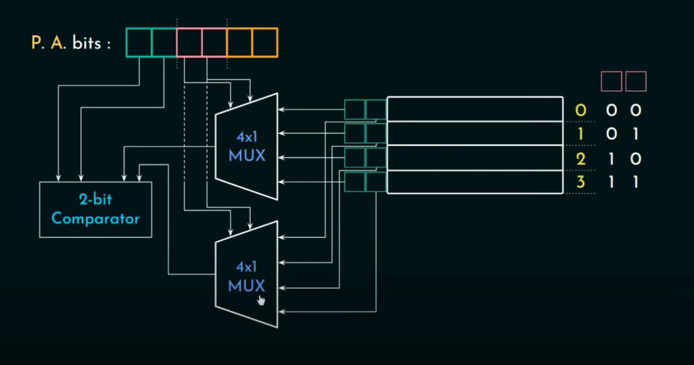

[Computer Organization and Architecture](https://www.youtube.com/playlist?list=PLBlnK6fEyqRgLLlzdgiTUKULKJPYc0A4q)

# direct memory mapping
会导致间断访问时，遇到conflict miss


# [associative mapping](https://www.youtube.com/watch?v=uwnsMaH-iV0&list=PLBlnK6fEyqRgLLlzdgiTUKULKJPYc0A4q&index=14)
P.A.bits只分成了tag和line offset. 每个block都会被分配到任意的cache line.
* 优点: 不会有conflict miss
* 缺点: 查看数据的时候需要遍历所有的cache line


# [set associative mapping](https://www.youtube.com/watch?v=KhAh6thw_TI&list=PLBlnK6fEyqRgLLlzdgiTUKULKJPYc0A4q&index=17)
物理实现
把cache line分成几个set。 每个line block都可以对应到一个set里的任意一个cache line
k-way set associative
```
1 set = k cache linkes 
```
但一个set里面的cache在remove的时候, 按照什么顺序呢

# Cache Desing

## 写入策略
1. write hit: 数据存在缓存中
    * write through
    同时写入缓存和主存. 写入时间过长, 用于不怎么写的场景.
    * write back / write deferred
    只有缓存更新, 设置dirty-bit. 当cache失效时, 才写入主存.
    适合很多写的场景
2. write miss:
    * write allocate
    先把数据移入缓存, 然后用write through 或者 write back(常用)
    * no-write allocate
    直接修改主存的数据
