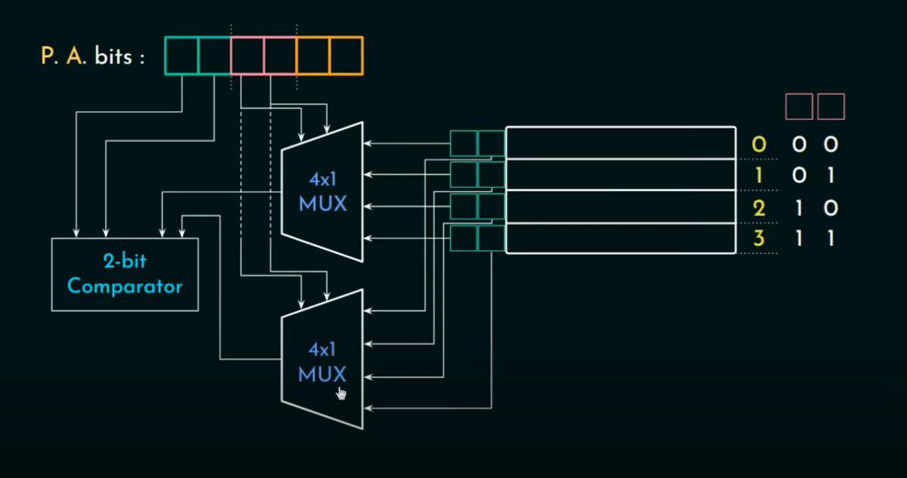
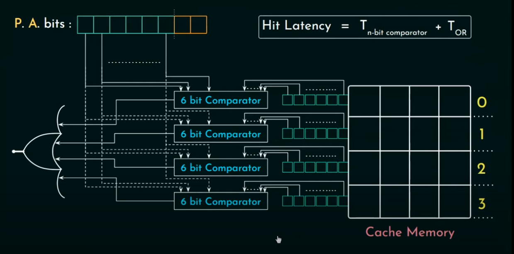

[Computer Organization and Architecture](https://www.youtube.com/playlist?list=PLBlnK6fEyqRgLLlzdgiTUKULKJPYc0A4q)

# CPU架构
## 冯诺依曼结构
指令和data都放memory

## 哈佛架构
把指令和data的内存分开存放.

# direct memory mapping
会导致间断访问时，遇到conflict miss


# [associative mapping](https://www.youtube.com/watch?v=uwnsMaH-iV0&list=PLBlnK6fEyqRgLLlzdgiTUKULKJPYc0A4q&index=14)
P.A.bits只分成了tag和line offset. 每个block都会被分配到任意的cache line.
* 优点: 不会有conflict miss
* 缺点: 查看数据的时候需要遍历所有的cache line


# [set associative mapping](https://www.youtube.com/watch?v=KhAh6thw_TI&list=PLBlnK6fEyqRgLLlzdgiTUKULKJPYc0A4q&index=17)
物理实现
把cache line分成几个set。 每个line block都可以对应到一个set里的任意一个cache line
k-way set associative
```
1 set = k cache linkes 
```
但一个set里面的cache在remove的时候, 按照什么顺序呢

# Cache Desing

## 写入策略
1. write hit: 数据存在缓存中
    * write through
    同时写入缓存和主存. 写入时间过长, 用于不怎么写的场景.
    * write back / write deferred
    只有缓存更新, 设置dirty-bit. 当cache失效时, 才写入主存.
    适合很多写的场景
2. write miss:
    * write allocate
    先把数据移入缓存, 然后用write through 或者 write back(常用)
    * no-write allocate
    直接修改主存的数据

# Cache replacement Policies
[网址](https://www.youtube.com/watch?v=7lxAfszjy68&list=PLBlnK6fEyqRgLLlzdgiTUKULKJPYc0A4q&index=26)

## 随机替换
曾经用于ARM(advanced risk machine) architecture

## FIFO
## LIFO
这样不是导致(4-way)前3个cache一直是占用的，只有最后一个cache line变化吗
## Optimal Replacement/Belady's Optimal Algorithm
把接下来访问到的时间最远的那个cacheline移除(但是预测这个不可能，所以实现不了)
但是可以用来作为基线。这个是最好的结果。来和FIFO, LIFO那些进行比较

## [Recency Based Policies](https://www.youtube.com/watch?v=_Hh-NcdbHCY&list=PLBlnK6fEyqRgLLlzdgiTUKULKJPYc0A4q&index=27)
全部使用age bits来跟踪访问的顺序

### MRU
移除最近使用的块。对于循环模式不错(因为循环后就不用了)
思考: MRU只要一个计数器就能知道emit哪个。而LRU却需要保存每个cacheline的信息。如果我们LRU只保留最近用了哪个，其他三个随机呢。或者我们不用遍历比较，随机抽3个出来比较

### LRU
通过age bit. 新来的block放在age bit = 0b00的位置. 其余的cache line全部 -1.  
当cache被访问的时候, 设置为 0b11 同时, 比他age bit大的都减1. 比他age bit小的不变  
需要的age bit: 一个数字表达出0,1,2,3的顺序(可能性有4!种), 所以需要log(2, 4) = 5个age bits  
当set的way达到8或者16的时候，需要的age bit数 * set数会非常huge, 所以不怎么用了, 所以来了PLRU

### PLRU
pseudo least recently used
每一半的cache line, 用一个bit代表最近访问的是上半部分还是下半部分
通过 way - 1个age bit就能保留信息来决策。同时能完美地实现MRU

## Frequency Base Policy  
### Least Frequently Used  
思考: frequency只保留次数。会不会导致一个cache一直占用着呢


# 缓存一致性问题及原则

## Cache Coherency Protocols
1. 术语: 通过保存每个cache line的状态
    * Modified: 内容是否变化, 导致和主存不一致
    * Shared: 保存了没有变化的数据,可以出现在其他核里
    * Invalid: 数据不在可靠了,因为其他core改了数据

    * Exclusive: 只有一个core有(如果其他核读了,就变成Shared)
    * Owned: 只有一个core拥有, 其他core可以从这里读取
    * Forward(Shared的特殊状态). 当数据变化是,Forward需要更改其他shared的cache line

### Snooping-based Protocol/Bus-based Protocol
所有的核都监控主存, 对应数据变化是操作cache line  
所有的protocol可以和不同的写入策略组合
* write update:
变更时, 修改cache line
    * write through
    * write back

* write invalidate:
变更时,设置成invalid.  
思考: 但是2个核同时变更怎么办
    * write through
    * write back

### Directory-based Protocol
到core多时snooping-base会导致bug很busy, 所以引入directory-based protocol. 多用于集群
每个node, 记录每个cache-line被哪些node share. 更新的时候,直接通知各个node设置成invalid


## Ram
Random Access Memory

ddr: double data rate时钟上升沿和下降沿都可以传递一次数据


# Secondary Memory
磁盘. 通过virtual memory mapping实现pages来和main memory交互
