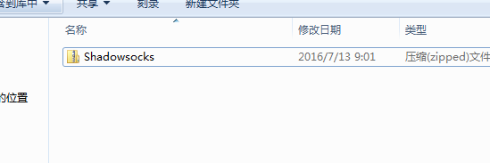
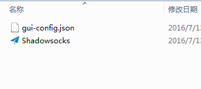
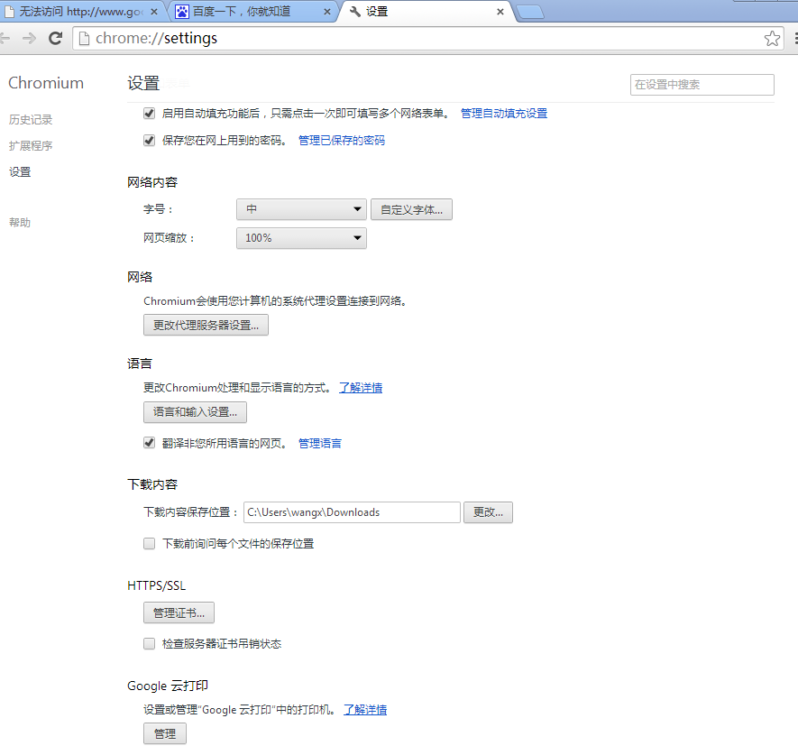
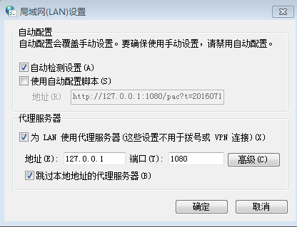

# shadowsocks

## 下载软件
私人分享

## 解压软件

## 设置软件
* 启用系统代理
* 服务器选择 www.ramwin.com:8388

## 完成
可能要重启电脑，重启浏览器，重启shadowsocks才能起作用

## 如果失败了，就手动设置

### 关闭shadowsocks的全局代理模式
### 浏览器设置
* 打开设置 - 更改代理服务器设置

* Internet属性 - 连接

* 局域网设置
    1. 自动检测设置
    2. 代理服务器选择 `127.0.0.1` 端口: `1080` 勾选跳过本地地址的代理服务器

